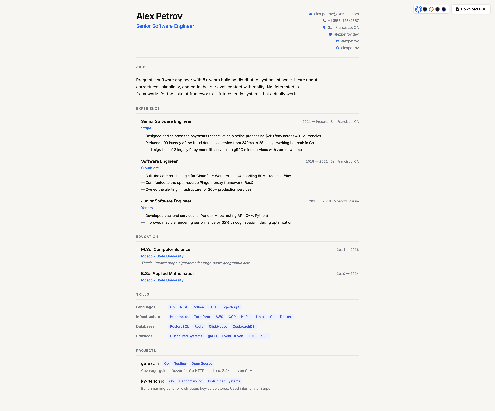

# CV Generator


> Edit one YAML file. Get a responsive web CV with PDF export. Deploy to GitHub Pages in two clicks.

No build step. No npm install. No framework. Just static files that work.

**Demo**: https://sohje.github.io/cv-gen/

---

## Features

- **5 colour themes** — Light, Dark, Warm, Slate, Midnight; system preference auto-detected; persists to `localStorage`
- **PDF export** — A4, forced light mode during capture, page-break hints to avoid splitting entries
- **Profile photo** — optional `meta.photo` field; circular, shown in browser and PDF
- **3 input formats** — YAML, JSON, or Markdown with YAML frontmatter
- **Responsive** — single breakpoint at 768px
- **Open Graph meta** — `og:title` / `og:description` populated from your data after load
- **Zero build step** — plain ES modules, no bundler, no transpiler
- **Offline-safe libs** — `js-yaml` and `html2pdf` vendored in `libs/`

---

## Quick start

```bash
# Any static server works
npx serve .
# or
python3 -m http.server 8080
```

Open `http://localhost:8080`, edit `cv.yaml`, refresh.

---

## Project structure

```
/
├── index.html
├── cv.yaml                     ← edit this
├── assets/
│   ├── css/style.css
│   └── js/
│       ├── main.js             ← entry point (ES module)
│       ├── loader.js           ← fetch + parse YAML/JSON/MD → unified schema
│       ├── renderer.js         ← schema → DOM
│       ├── theme.js            ← palette registry + picker
│       └── pdf.js              ← html2pdf wrapper
└── libs/
    ├── js-yaml.min.js
    └── html2pdf.bundle.min.js
```

---

## Data format

The loader tries files in this order: `cv.yaml` → `cv.yml` → `cv.json` → `cv.md`.

### YAML (recommended)

```yaml
meta:
  name: "Your Name"
  title: "Your Title"
  email: "you@example.com"
  phone: "+1 555 000 0000"
  location: "City, Country"
  website: "https://yoursite.com"
  linkedin: "https://linkedin.com/in/yourhandle"
  github: "https://github.com/yourhandle"
  photo: "assets/photo.jpg"   # any URL or relative path

about: >
  A few sentences about yourself.

sections:
  - type: experience
    title: "Experience"
    items:
      - company: "Acme Corp"
        role: "Senior Engineer"
        period: "2021 — Present"
        location: "Remote"
        bullets:
          - "Did something impactful"
          - "Improved X by Y%"

  - type: education
    title: "Education"
    items:
      - institution: "Some University"
        degree: "B.Sc. Computer Science"
        period: "2014 — 2018"
        note: "Optional note about thesis or honours"

  - type: skills
    title: "Skills"
    items:
      - category: "Languages"
        tags: ["Go", "Python", "TypeScript"]
      - category: "Infrastructure"
        tags: ["Kubernetes", "AWS", "Terraform"]

  - type: projects
    title: "Projects"
    items:
      - name: "my-project"
        description: "What it does and why it matters."
        url: "https://github.com/you/my-project"
        tags: ["Go", "Open Source"]

  - type: custom
    title: "Languages"
    items:
      - label: "English"
        value: "Native"
      - label: "Russian"
        value: "Fluent"
```

### JSON

Same structure as YAML, just in JSON.

### Markdown

YAML frontmatter with `meta` and `about`, then sections as `## H2` headings.

```markdown
---
meta:
  name: "Your Name"
  ...
about: "About text"
---

## Experience

### Company | Role | Period | Location
- bullet one
- bullet two

## Skills

### Languages
Go, Python, TypeScript
```

### Unified schema

All parsers output the same contract consumed by `renderer.js`:

```js
{
  meta:     { name, title, email, phone, location, website, linkedin, github, photo },
  about:    "string",
  sections: [
    {
      type:  "experience" | "education" | "skills" | "projects" | "custom",
      title: "string",
      items: [...]  // structure depends on type
    }
  ]
}
```

---

## Themes

Five colour palettes are available via the theme picker in the top-right corner:

| ID         | Style              |
|------------|--------------------|
| `light`    | Default light       |
| `dark`     | Neutral dark        |
| `warm`     | Cream bg, amber accent |
| `slate`    | GitHub-dark, steel blue |
| `midnight` | Deep navy, violet accent |

**Adding a new palette** — two steps:

1. Add an entry to `PALETTES` in `assets/js/theme.js`:
   ```js
   forest: { label: 'Forest', dark: true },
   ```
2. Add a CSS block in `assets/css/style.css`:
   ```css
   html[data-theme="forest"] {
     --c-bg:           #0D1A0F;
     --c-accent:       #4ADE80;
     /* ... remaining  ... */
   }
   ```
3. Add a theme switch button in `index.html`.

---

## Profile photo

Add a `photo` field to `meta` in your `cv.yaml`:

```yaml
meta:
  name: "Your Name"
  photo: "assets/photo.jpg"   # relative path or full URL
```

Place the image file next to `index.html`. It renders as a circular portrait in the header and is included in PDF export.

---

## Updating vendored libs

```bash
# js-yaml
npm pack js-yaml@4.1.0
tar -xzf js-yaml-4.1.0.tgz
cp package/dist/js-yaml.min.js libs/

# html2pdf
npm pack html2pdf.js@0.10.1
tar -xzf html2pdf.js-0.10.1.tgz
cp package/dist/html2pdf.bundle.min.js libs/
```

---

## Contributing

Bug reports and pull requests are welcome.

A few ground rules:
- **No build step** — keep it plain ES modules, no bundler required
- **No new runtime dependencies** — vendor into `libs/` with pinned version if truly needed
- **Backwards compatible** — a `cv.yaml` without new fields must continue to render correctly
- One feature per PR; keep diffs small and reviewable

---

## Roadmap

Things that would be genuinely useful, roughly in priority order:

- [ ] **JSON Schema for `cv.yaml`** — IDE autocompletion and inline error hints via `$schema`
- [ ] **Layout variants** — sidebar layout (photo/contact left column), compact layout for long CVs
- [ ] **i18n section labels** — `meta.lang: ru` to localise built-in strings like "About"
- [ ] **Live preview** — drag-and-drop a YAML file onto the page → instant render without a server
- [ ] **QR code** — auto-generated in PDF footer linking to the web version

Non-goals: a backend, a SaaS wrapper, a React rewrite, npm scripts for something that doesn't need them.

---

## License

MIT
